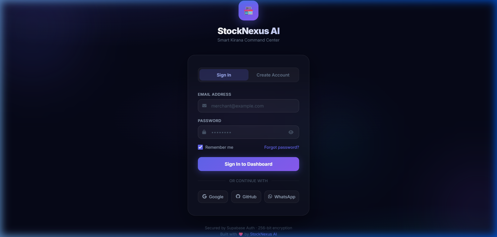
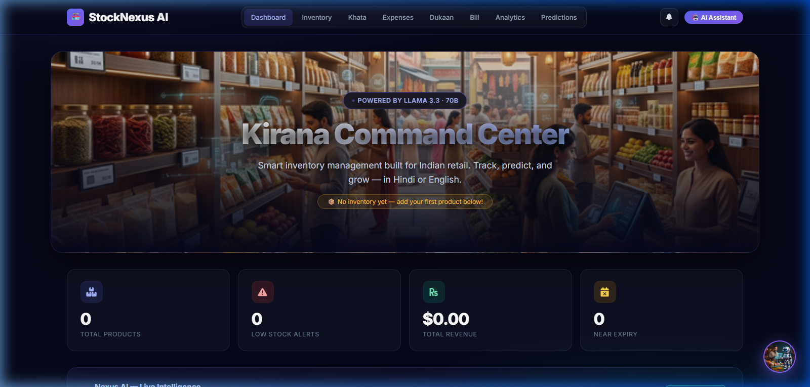
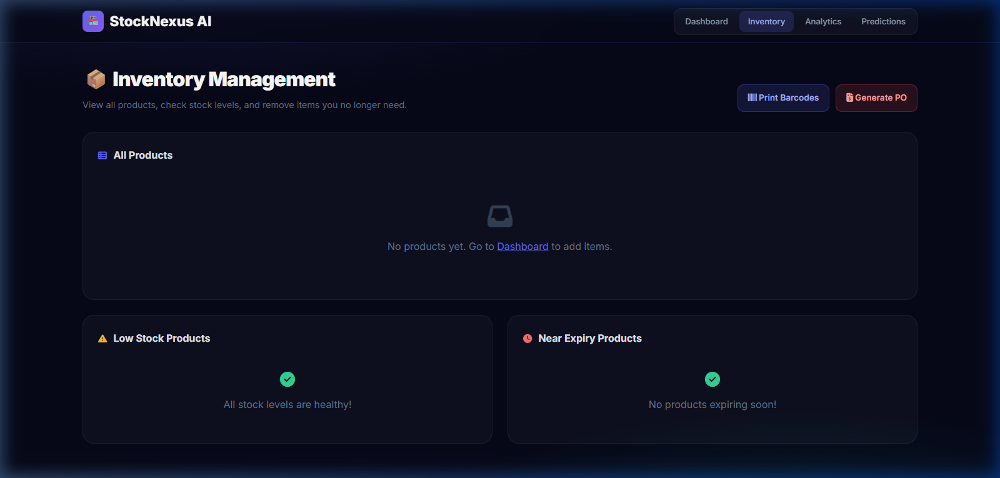
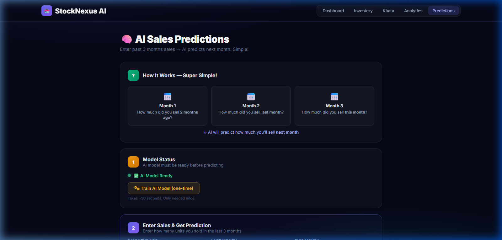

# StockNexus AI 🏪

**Smart Kirana Command Center** - An AI-powered inventory management system tailored for Indian retail, featuring live stock tracking, credit books (Khata), expense management, and predictive analytics.

[](https://www.python.org/)
[](https://flask.palletsprojects.com/)
[](https://www.postgresql.org/)
[](https://groq.com/)

---

## 🌟 Key Features

- 📊 **Real-time Inventory Tracking**: Automated stock level monitoring with low-stock alerts.
- 💳 **Smart Khata (Credit Book)**: Digital ledger for customer debts and payments with loyalty point tracking.
- 📉 **Predictive Analytics**: LSTM-powered demand forecasting to optimize restocking schedules.
- 🤖 **AI Assistant**: Groq-powered chat interface for business insights and automated promo generation.
- 🧾 **Invoice Scanner**: OCR-based inventory updates from supplier invoices.
- 💰 **Expense Tracking**: Simplified daily business expense logging.
- 🔄 **Dual Mode**: Seamlessly switch between Cloud (Supabase) and Local (CSV) storage.

---

## 📸 Screenshots

### 🔑 Secure Authentication


### 📊 Kirana Command Center (Dashboard)


### 📦 Inventory Management


### 🔮 AI Predictions


---

## 🛠️ Tech Stack

- **Frontend**: HTML5, Vanilla CSS3 (Glassmorphism), JavaScript (ES6+)
- **Backend**: Python 3, Flask
- **Database**: PostgreSQL (Supabase) with Connection Pooling
- **AI/ML**: TensorFlow (LSTM), Groq (LLaMA 3.3), Scikit-learn
- **Data**: Pandas, Numpy

---

## 🚀 Quick Start

### 1. Clone the repository
```bash
git clone https://github.com/Yashwant-king/StockNexusAI.git
cd StockNexusAI
```

### 2. Install dependencies
```bash
pip install -r requirements.txt
```

### 3. Configure Environment
Create a `.env` file from the template:
```bash
cp .env.example .env
# Edit .env with your actual keys
```

### 4. Run the Application
```bash
python run.py
```
Access the dashboard at `http://localhost:5000`

---

## 🏗️ Architecture

StockNexus AI follows a modular monolithic architecture, utilizing:
- **Global Auth Hook**: Centralized session management.
- **CSV Fallback**: Automatic fallback to local storage if DB connection fails.
- **Predictive Engine**: Integrated training pipeline for custom shop data.

---

## 📝 License
This project is for demonstration and kirana store optimization purposes. Built with ❤️ by StockNexus AI.
